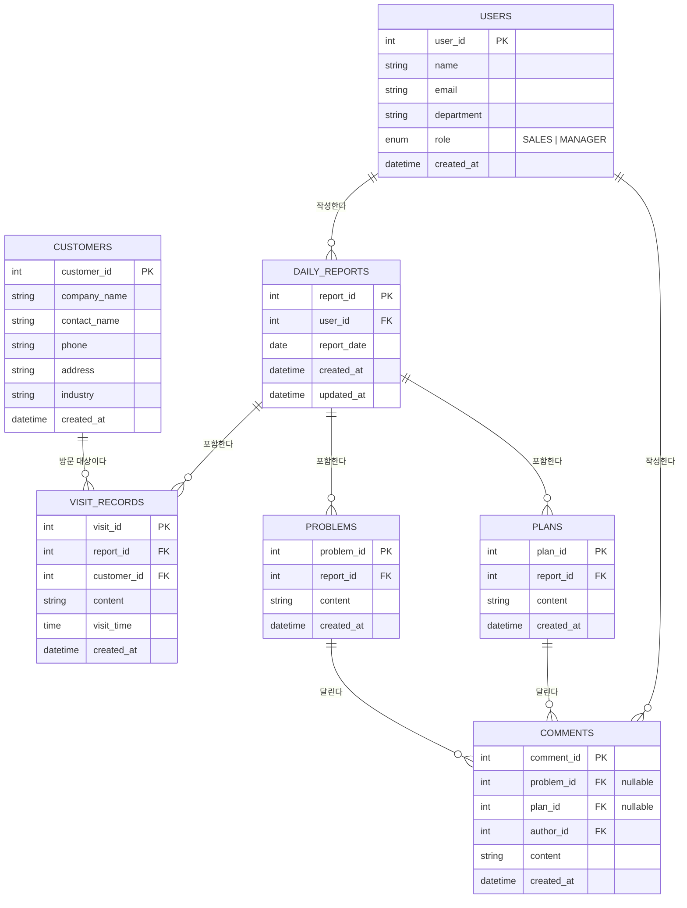

```mermaid
  erDiagram
      USERS {
          int     user_id     PK
          string  name
          string  email
          string  department
          enum    role        "SALES | MANAGER"
          datetime created_at
      }

      CUSTOMERS {
          int     customer_id  PK
          string  company_name
          string  contact_name
          string  phone
          string  address
          string  industry
          datetime created_at
      }

      DAILY_REPORTS {
          int     report_id   PK
          int     user_id     FK
          date    report_date
          datetime created_at
          datetime updated_at
      }

      VISIT_RECORDS {
          int     visit_id    PK
          int     report_id   FK
          int     customer_id FK
          string  content
          time    visit_time
          datetime created_at
      }

      PROBLEMS {
          int     problem_id  PK
          int     report_id   FK
          string  content
          datetime created_at
      }

      PLANS {
          int     plan_id     PK
          int     report_id   FK
          string  content
          datetime created_at
      }

      COMMENTS {
          int     comment_id  PK
          int     problem_id  FK  "nullable"
          int     plan_id     FK  "nullable"
          int     author_id   FK
          string  content
          datetime created_at
      }

      USERS         ||--o{ DAILY_REPORTS  : "작성한다"
      DAILY_REPORTS ||--o{ VISIT_RECORDS  : "포함한다"
      CUSTOMERS     ||--o{ VISIT_RECORDS  : "방문 대상이다"
      DAILY_REPORTS ||--o{ PROBLEMS       : "포함한다"
      DAILY_REPORTS ||--o{ PLANS          : "포함한다"
      PROBLEMS      ||--o{ COMMENTS       : "달린다"
      PLANS         ||--o{ COMMENTS       : "달린다"
      USERS         ||--o{ COMMENTS       : "작성한다"
```
